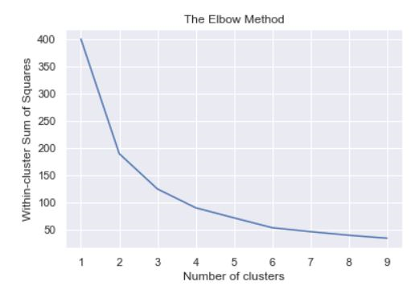
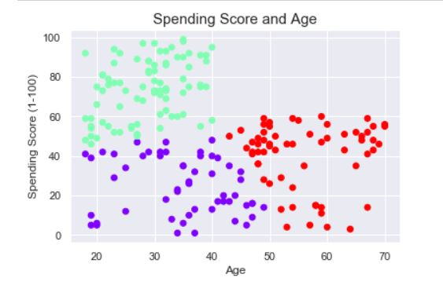
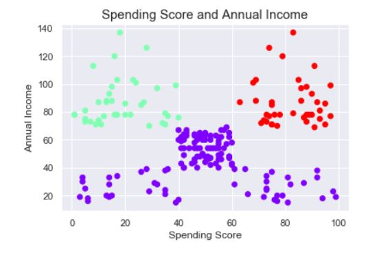

# Mall-Customer-Segmentation
A dataset of Customer Profile going into a Mall  
Reference: https://www.kaggle.com/vjchoudhary7/customer-segmentation-tutorial-in-python  

**Method Used: KMeans, PreProcessing, Clustered Using WCSS**  
  
  
# Summary  
  ## WCSS
As you can see in WCSS the Preferred Cluster is 3 so I clustered my Datasets into 3
  
  
## Spending score and Age
  
**Insight**  
As you can see in the **Red Cluster** which we can name them the Middle age to Elderly people.  
The reason why they mostly fall in the average spending score, it's because middle age to Elderly people tend to go to the Malls to socialize with their friends or just see people.   
Reference: White, Rob & Toohey, J.-A & Asquith, Nicole. (2013). Seniors in shopping centres. Journal of Sociology. 51. 10.1177/1440783313507494.  
  
  
**Violet Cluster**  shows a very low spending score and their age ranges from young adults to middle age. We can deduce that this cluster are the ones who doesn't like to go to this mall.  
  
**Green Cluster** shows a very high spending score and has the same age range of the Violet Cluster which we can call them The Loyal Customers of this Mall.  
  **Conclusion For Spending Score and Age**  
  We should analyze why does the violet cluster doesn't want to go into our mall, maybe they don't want the environment of the mall?, they're few shops in the mall?, few relevant shops in the mall?, and etc. So that we can still make the Violet Cluster profitable in our Mall  
  Second we should take care our Green Cluster, because they're the ones who are bringing profits to our Mall and should offer more Promotions to them.  
  Lastly the next potential customers can be the Red Cluster, because most of them fall into the average spending score and we can still increase it by making them spend more in social stuffs like bringing in a bingo center for them.  
    
    
## Spending Score and Annual Income
  
**Insight**   
There is a Concentration in the middle part by the **Violet Cluster** which we can call them the Average Spenders and this average spenders are almost the majority of our customers.  
**Green Cluster** are the ones who are The Rich People but doesn't want to spend here in our Mall.
**Red Cluster** are our Loyal Customers they are rich and spend a lot of money in our mall.  
**Conclusion For Spending Score and Annual Income**  
We need to identify why does the Green Cluster doesn't want to spend money on our mall and we also need to maximize the Violet Cluster which is the average spenders by giving them promotions and maintain our loyal customer base by giving them Prestige promotions due to their spending to the mall.  
  
  # Conclusion  
Thank you for reading my First Repository in Github!  I'm still new to 
 Data Science Industry so I would like to apologize if there are any mistakes that I have made in my coding in notebook. I have recently completed my Data Science Training in Udemy and I really want to apply my knowledge with my Marketing Degree and Data Science in order to have good Insights and expand my career to other Business Cases.
